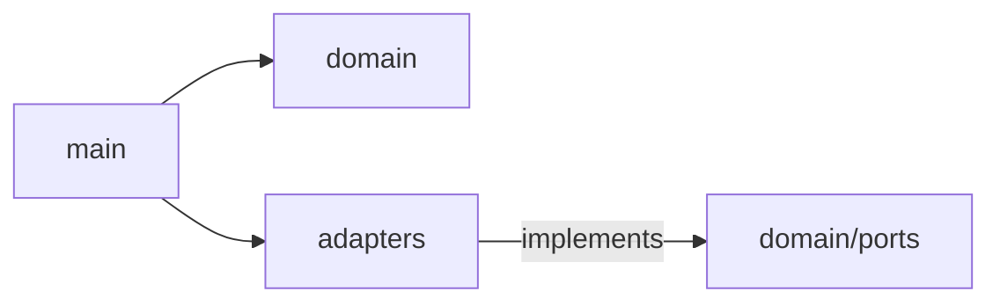
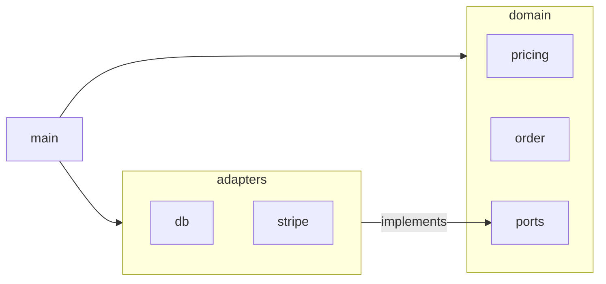
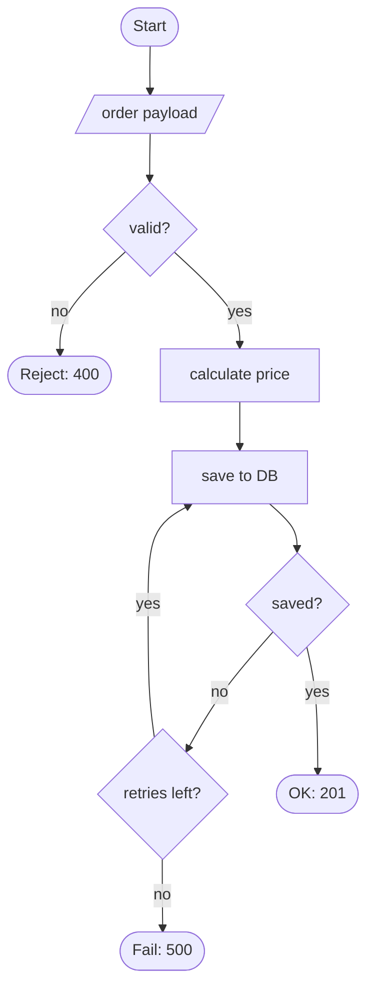
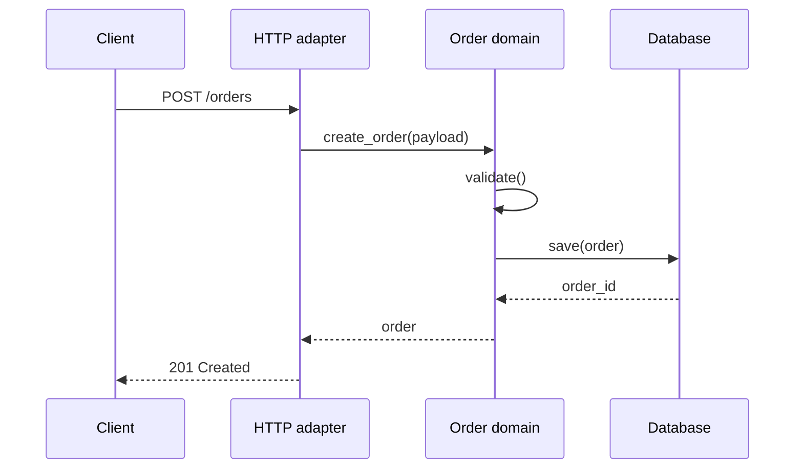
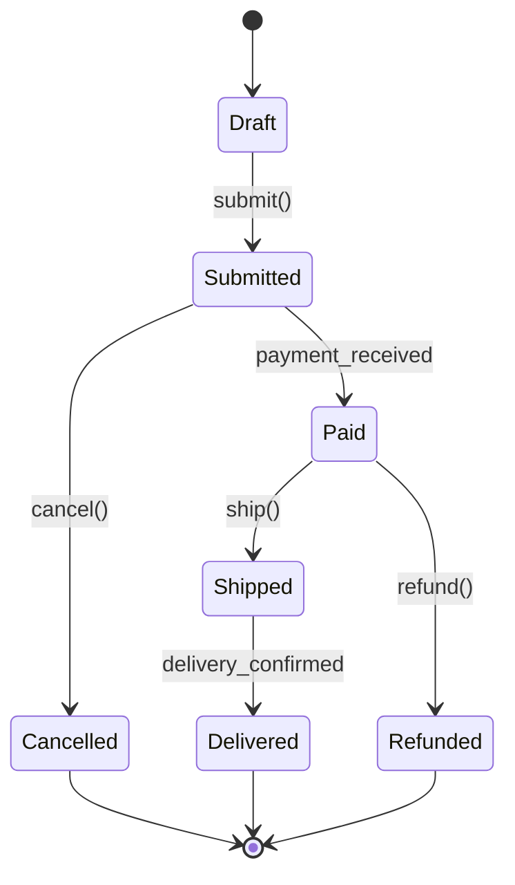
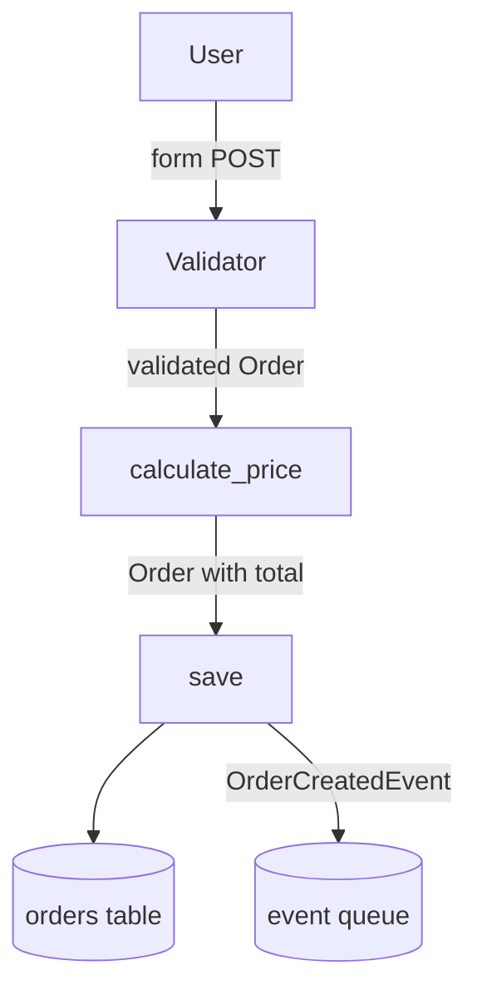
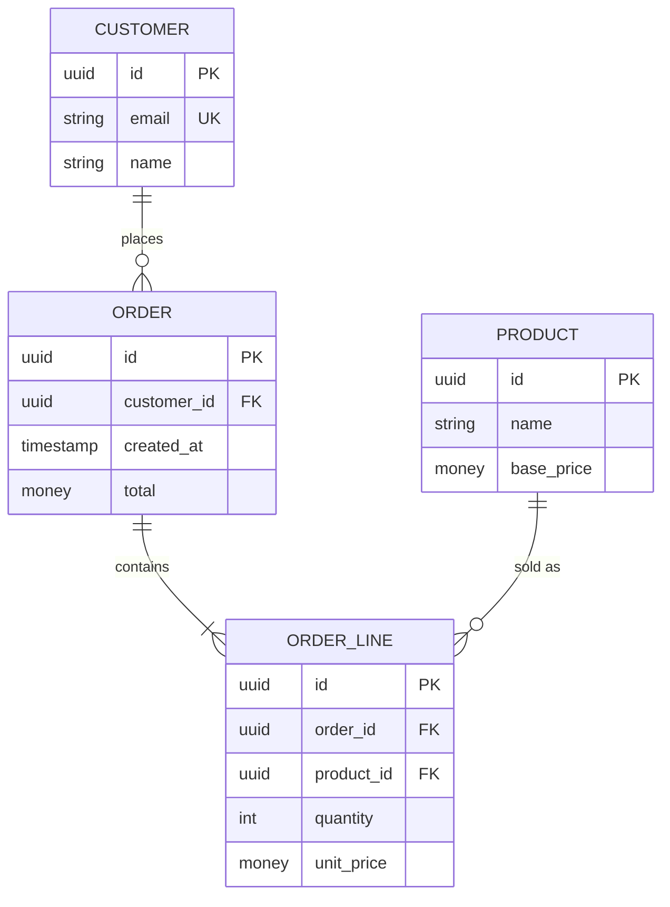
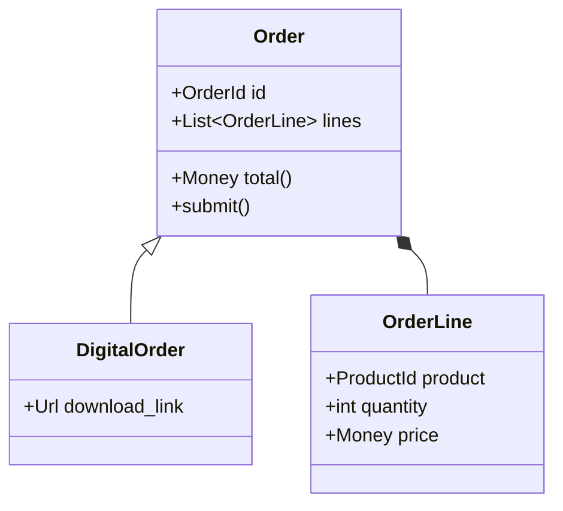

> [README](../../README.md) > [Docs](../) > **Auto-Documentation**

# Auto-Documentation

> **TL;DR** -- Run two prompts to generate an architecture overview and module docs from your actual code. Ask the AI to cite file and line for every claim so you can spot-check it. Regenerate on triggers (refactor, release, new person joining), not on a schedule. Diagrams are embedded building blocks, not separate files. End-user docs are out of scope.

Six months into a project, your README mentions an entry point that has been renamed. Your architecture diagram shows a module that was deleted in the last refactor. A new developer joins and spends two days chasing ghosts. This is documentation rot. Every project has it. Classical software engineering says draw the diagrams first, then write the code to match; almost nobody does that, and those who do watch the diagrams drift the moment the code moves.

AI gives you a third option: regenerate from the code whenever it matters, before a release, after a refactor, when someone new joins. The result is a snapshot, not a living document. The price is that AI will invent functions that do not exist or "clarify" behavior that is not in the code, so everything it produces needs a deliberate spot-check. How deliberate depends on the stakes: a throwaway internal module needs less than an architecture overview a new hire will read on day one.

This guide covers developer documentation: architecture overview, module docs, and Mermaid diagrams. End-user docs have different failure modes and deserve their own guide.


## Why Vibe Coders Must Care

You coded fast. The project works. Three weeks later a collaborator joins, or you come back to the code after a break, and nobody can answer the basic question: where do I start reading? That is where most vibe-coded projects run into a wall. The code is fine. The mental map is gone.

You do not need to write the docs by hand. You need to know which files are worth having, and how to stop the AI from inventing content that is not in your code. The second part is the harder one: a generated doc that lies about the code is worse than no doc at all, because one wrong function name sends a reader down a dead end. Every prompt in this guide tells the AI to cite file and line for every claim, which leaves you a trail to spot-check. That is not a proof (the same model that invented a function can invent a plausible line number for it), but it is the difference between a doc you can check in minutes and one you have to rewrite by hand.


## Documentation

With the two sections below you cover the core need: one walks you through generating an **architecture overview** for the whole project, the other through generating **module docs** for the parts that matter. Each section has a prompt that pulls from your actual code, and each generator embeds whichever diagrams help the reader, pulled from the [Diagram Building Blocks](#diagram-building-blocks) toolbox in the second half of this guide. You rarely call the diagram prompts by hand; they are the parts the generators assemble.

If you follow codeOath, some ground is already covered. **AGENTS.md** defines what the project is. **docs/decisions.md** or a set of ADRs records why certain paths were chosen. **docs/todo.md** tracks open work. Those cover intent, history, and backlog. What they do not cover is structure: how the code is laid out right now, which module does what, how the pieces connect. That is the gap the two generators below close.

### 1. Architecture Overview

**What it is:** A single page, usually `docs/architecture.md`, that answers one question AGENTS.md and decisions.md do not: how is the code actually laid out right now? AGENTS.md tells a reader what the project is. decisions.md tells them why it ended up like this. The architecture overview is the structural snapshot on top: which modules exist, what each one is responsible for, and how they connect. If a new developer reads one file before touching the code, this is the file.

**Generate:**

> "Generate `docs/architecture.md`: Purpose (one paragraph from AGENTS.md), Modules table (name, responsibility, key files), Mermaid `flowchart LR` of dependencies, 2-3 paragraphs on how modules connect. Cite file and line inline for every dependency and claim, like `(src/adapters/db.py:12)`. Drop what you cannot cite. Append unclear items to docs/todo.md as `- [ ] clarify: ...`."

**Verify** (run in a fresh chat session, not the one that generated the doc; a fresh context is less likely to re-confirm its own mistakes):

> "Verify `docs/architecture.md`: every module in the table must be a folder that exists, every arrow in the diagram must come from a real import, every inline citation must point to a real file and line. Remove anything that does not check out."

**Example output (fragment):**

````markdown
## Modules

| Module | Responsibility | Key Files |
|---|---|---|
| `domain/` | Pure business logic, no I/O | `order.py`, `pricing.py`, `ports.py` |
| `adapters/` | Database, HTTP, external APIs | `db.py`, `stripe_client.py` |
| `main.py` | Composition root | `main.py` |

## Diagram



## How They Connect

The composition root constructs adapter instances and passes them into domain functions (`src/main.py:12`). Domain never imports from adapters directly; it depends on function signatures defined in `domain/ports` (`src/domain/ports.py:1-40`). Adapters implement those ports (`src/adapters/db.py:8`, `src/adapters/stripe_client.py:5`).
````

### 2. Module Documentation

**What it is:** One markdown file per module, living in `docs/` and named after the module (for example, `docs/pricing.md` for a `pricing` module). Each file describes one module in depth: purpose, public API, dependencies, invariants. Not every module needs one.

**Start with:** your entry point (`main`, the file that wires everything together) and the one or two biggest modules, the ones with the most files and the most imports from the rest of the project.

**Add later:** modules with non-obvious invariants, any module a new collaborator will need to touch first, any module whose public API you are about to change.

**Generate:**

> "Generate `docs/<module-name>.md` for `src/<module-path>/`: Purpose, Public API table (symbol, kind, one-line docstring or `(no docstring)`), Dependencies, Invariants, Not responsible for, Notable WHY-comments quoted with file:line. Embed a diagram from the toolbox below if one fits (class, state, activity, db schema). Cite file and line inline for every symbol and claim. Drop what you cannot cite. Append unclear items to docs/todo.md as `- [ ] clarify: ...`."

**Verify** (fresh chat session, same reason as above):

> "Verify `docs/<module-name>.md`: every symbol in the Public API table must exist in `src/<module-path>/`, every dependency must be a real import, every inline citation must point to a real file and line. Remove anything that does not check out."

**Example output (fragment):**

```markdown
## Public API

| Symbol | Kind | One-line | Source |
|---|---|---|---|
| `calculate_price(order, tax_rate)` | function | Returns total price including tax | `pricing.py:15` |
| `OrderStatus` | enum | States an order can be in | `order.py:8` |
| `InvalidOrderError` | exception | Raised when order fails validation | `errors.py:3` |

## Dependencies

- Internal: `domain.money` (`pricing.py:2`)
- External: none (pure domain module)

## Invariants

- `tax_rate` must be between 0 and 1 (`pricing.py:18`, guard clause).
- `calculate_price` never mutates `order` (`pricing.py:15-30`, pure function).

## Notable Comments

- `pricing.py:24` -- "rounding mode is HALF_EVEN on purpose: matches the accounting system's expectation; see decisions.md#pricing-rounding".
```

**Warning:** Do not run this prompt on every module. You will drown in doc files that nobody reads. Reserve it for core modules, public-facing packages, and modules with non-obvious invariants.

**Do you need a separate symbol list?** No. The Public API table in a module doc already lists every exported function, class, and constant. A second file that repeats the same symbols is dead weight. If you want a project-wide index across all modules, use your language's built-in documentation tool -- it reads the code directly and cannot hallucinate symbols the way an AI-generated list can. Every mainstream language has one: Sphinx for Python, pdoc as a simpler Python alternative, TypeDoc for TypeScript, rustdoc for Rust, godoc for Go. They all take your source files and produce browsable symbol docs.


## When to (Re-)Generate

Not continuously. Generated docs are expensive to trust because every regeneration needs a spot-check. Regenerate on specific triggers:

- **After a large refactor.** Anything that moves code between modules invalidates architecture.md and the architecture diagram.
- **Before a release.** Consumers of your project will read whatever is in `docs/` at release time. Make sure it matches.
- **When a new developer joins.** If they are going to read the docs, you want them reading current ones. Regenerate the day before onboarding.
- **When a module is added or renamed.** The module docs and the architecture overview need to catch up.
- **Never just because "it has been a while."** Time is not a signal. Change is.


## Pitfalls

Things that go wrong. Watch every time.

- **The AI invents.** Symbol names, folder paths, function behavior, even the file-and-line citations you ask for to verify them: a `UserService` that does not exist, `domain/validators/` listed as a top-level module when it is a sub-folder, a docstring paragraph guessed from a function name. The "only describe what is actually in the code, do not invent behavior" line in every prompt is the main guardrail; do not remove it. Spot-check symbol names and folder paths directly, thirty seconds of filesystem browsing catches most of these. Skim the inline citations; for high-stakes docs (release, rewrite, onboarding) open the file yourself. See [AI Code Review](ai-code-review.md) for independent-reviewer patterns.
- **Stale diagrams.** An out-of-date diagram is worse than none, because the reader trusts it. If you cannot commit to regenerating on the triggers above, do not publish it.
- **Module-README sprawl.** A README in every folder produces noise. Only generate for modules a new developer actually needs to understand.
- **Non-determinism.** Two generations of the same prompt produce different diagrams: labels, ordering, and arrow directions drift. Fine for a snapshot, but a git diff of `architecture.mmd` is not a signal of real code change. Do not chase cosmetic diffs.
- **Example outputs prove nothing.** The snippets in this guide are illustrative, not validated. Whether your generated doc is correct is your question to answer, every time.


## Encoding Into Your Project

Once you decide which documentation your project will maintain this way, record it in AGENTS.md. Every AI session reads AGENTS.md, so the policy applies without you having to cite it each time.

A clarification, since this is often misread: writing the list of generated files into AGENTS.md does **not** make the AI regenerate on every session. It makes the policy visible, so that when you say "update the docs", the AI knows which files are in scope, what the regeneration triggers are, and which files are hand-edited and must not be touched. The triggers in the section above are still the things that decide *when* to regenerate.

The list is short on purpose. Diagrams are components embedded inside the two generators' output (architecture overview, module docs), not standalone files. You do not list them separately and you do not regenerate them on their own triggers. When the architecture overview is regenerated, its architecture diagram comes with it. When a module doc is regenerated, its class or state or schema diagrams come with it. That is the whole point of treating diagrams as building blocks.

```markdown
## Generated Documentation

Generated, not hand-edited. Regenerate on the triggers below.

- `docs/architecture.md` -- structural overview including the embedded architecture diagram. Regenerate after large refactors and before release.
- `docs/<module-name>.md` -- one per core module, including whichever diagrams the module needs (class, state, activity flowchart, database schema). Regenerate when the module's public API or internal structure changes.

Hand-edited docs (not covered by this process):
- `README.md` (project root)
- `docs/decisions.md`
```

With this in place, "update the docs" becomes "regenerate the files listed in AGENTS.md and spot-check." That is a task of minutes or hours depending on project size and the spot-check depth you pick, not a task of days. The ceiling moves with the stakes, but the floor drops dramatically.


---

**Stopping point.** If you run the two generators above and spot-check the output, you already have the core of your developer docs. The rest of this guide is the toolbox the generators pull from, plus ad-hoc prompts for when you want a targeted picture of one function, one lifecycle, or one database schema. Read on only if you need one of those, or if you want to understand how the embedded diagrams are produced.

---

## Diagram Building Blocks

This section is the toolbox the generators above pull from. Diagrams show what text cannot: shape, direction, concurrency, where the cycles are. The hard part is keeping them up to date.

**How this section is used.** The default path is automatic: you run the architecture overview or a module doc generator from the section above, and it embeds whichever diagrams fit. You usually do not invoke the prompts below by hand. The secondary path is ad-hoc: when you want a targeted picture of one specific function, one state machine, or one use case without generating a full doc around it, you can run a single diagram prompt standalone. Both paths use the same building blocks with the same checks.

**What is Mermaid?** A small markup language for writing diagrams as plain text. You write a few lines inside a fenced code block marked ` ```mermaid `, commit the file to your repo, and GitHub and GitLab render it as an actual picture when someone opens the file. No image files to maintain, no external editor, no broken PNGs. Because it is text, AI can generate it from your code, and you can diff it in git like any other source file.

Seven building blocks cover the common cases. Static structure: **architecture** (modules and their dependencies) and **class** (types and their relationships). Behavior: **activity flowcharts** (a procedure with decisions), **call flow** (runtime interactions across components), and **state** (the lifecycle of one entity). Data: **data flow** (data in motion, where it enters, moves, and leaves) and **database schema** (data at rest, the tables and their relationships). Each block is self-contained: a prompt, an example, and two checks.

**Which one do I need?** Pick by what you are actually trying to do:

| You want to ... | Use |
|---|---|
| See which modules exist and who calls whom | [Architecture Diagram](#architecture-diagram) |
| Walk through a function that has `if`s, retries, and error paths | [Activity Flowchart](#activity-flowchart) |
| Show what happens end to end when something runs, like "user submits an order" | [Call Flow Diagram](#call-flow-diagram) |
| Draw the states of an order, a job, a session, and how it moves between them | [State Diagram](#state-diagram) |
| Trace where data comes in, where it moves, where it lands | [Data Flow Diagram](#data-flow-diagram) |
| Explain your database tables, columns, and foreign keys | [Database Schema Diagram](#database-schema-diagram) |
| Draw a class hierarchy with inheritance and composition (OO projects only) | [Class Diagram](#class-diagram) |


### Architecture Diagram

**What it is:** High-level boxes for modules and services, arrows for dependencies. Usually `docs/diagrams/architecture.mmd` or embedded in `docs/architecture.md`.

**Generate:**

> "Generate a Mermaid `flowchart LR` of this project's top-level module dependencies. One node per real module folder, one arrow per real import. Label arrows where the purpose is obvious (`uses`, `implements`). Group with `subgraph` where it helps. Below the diagram, list each arrow with its source file and line. Drop arrows you cannot source. Do not infer from names."

**Example output:**



### Activity Flowchart

**What it is:** A classical flowchart showing a procedure step by step, with branches at every decision. This is the flowchart you drew in school: rounded corners for start and end, rectangle for a processing step, diamond for a decision, parallelogram for input or output. Mermaid renders these shapes directly with `([...])`, `[...]`, `{...}`, and `[/.../]`. Use it when you want to show what one function or use case actually does, including the `if`s, the retries, and the early returns.

**Analogy:** The decision tree you drew to decide whether to bring an umbrella.

**Generate:**

> "Generate a Mermaid `flowchart TD` for [function or use case]. Shapes: `([Start])` / `([End])` for terminators, `[step]` for steps, `{decision?}` for branches, `[/data/]` for I/O. One node per real step, one diamond per real branch (`if`, `match`, early return). Below the diagram, list each node with its source file and line. Drop anything you cannot source. Do not invent steps or branches."

**Example output:**



### Call Flow Diagram

**What it is:** "When X happens, this calls that, which calls this, and eventually returns." A sequence diagram for one specific use case, not the whole system. Usually `docs/diagrams/call-flow-<use-case>.mmd`. Mermaid calls this a `sequenceDiagram`.

**Generate:**

> "Generate a Mermaid `sequenceDiagram` for [use case]. Each participant is a module or external system, each message is a real function call or return. Show the main path; note branches as comments. Below the diagram, list each message with its source file and line. Drop messages you cannot source. Do not invent steps."

**Example output:**



### State Diagram

**What it is:** The lifecycle of one stateful thing: an order, a user session, a job, a connection. Nodes are states, arrows are transitions labelled with the event that causes them. Usually `docs/diagrams/state-<entity>.mmd`. Only worth generating when the state space is non-trivial. Two or three states rarely need a picture; a dozen with conditional transitions absolutely do. This is the Mermaid version of the UML state machine diagram.

**Analogy:** A game's level map. You can see every place you can be and every path between them.

**Generate:**

> "Generate a Mermaid `stateDiagram-v2` for [entity]. One node per state from the enum or type, one transition per real state change in the code, labelled with the event or function that triggers it. Use `[*]` for initial and terminal states. Below the diagram, list each transition with its source file and line. Drop transitions you cannot source. Do not invent states."

**Example output:**



### Data Flow Diagram

**What it is:** Where data enters the system, where it is stored, where it is transformed, and where it leaves. Useful for projects that move data around (pipelines, ETL, integrations). Usually `docs/diagrams/data-flow.mmd`. This is a practical data-movement diagram for developer docs, not a formal DFD with strict element taxonomy and levelling; if you need the classical notation for a systems-analysis exercise, reach for a dedicated tool.

**Generate:**

> "Generate a Mermaid `flowchart TD` showing how data moves in this project. Nodes are real data sources, stores, and transformation functions. Label arrows with the data shape (`raw JSON`, `validated Order`, `row in orders table`). Below the diagram, list each arrow with its source file and line. Drop arrows you cannot source. Do not invent sources or destinations."

**Example output:**



### Database Schema Diagram

**What it is:** An entity-relationship diagram showing the database tables (or entity models), their columns with types, primary and foreign keys, and the cardinality of relationships. Generated from the source of truth: SQL migration files, ORM model classes, or a live schema dump. Mermaid supports this directly with `erDiagram`. Usually `docs/diagrams/db-schema.mmd` or embedded in the module doc of whichever module owns the tables.

A schema diagram also makes normalisation questions visible. A column named `tags` holding a comma-separated list is a first-normal-form violation. A column like `customer_name` duplicated in a table that already has a `customer_id` is a denormalisation (deliberate or accidental). An index column missing on a foreign key is a performance smell. The diagram does not prove normalisation, but it is the view that makes asking the question easy.

**Generate:**

> "Generate a Mermaid `erDiagram` from this project's schema source (migrations, ORM models, or dump). Entities with columns as `<type> <name>` and `PK`/`FK`/`UK` annotations. Relationships with correct cardinality (`||--o{`, `}o--o{`, `||--||`). Below the diagram, list each table and relationship with its source file and line, plus a short 'Normalisation notes' section for 1NF violations, duplicated columns, and foreign keys without an index. Drop what you cannot source. Do not infer relationships from column names."

**Example output:**



**Normalisation notes (fragment):**

- `ORDER.total` duplicates `sum(ORDER_LINE.unit_price * quantity)`. Intentional snapshot for audit trail, documented in `decisions.md#order-total-storage`.
- `ORDER_LINE.unit_price` duplicates `PRODUCT.base_price` at the moment of sale. Also intentional: product prices change, order prices do not.
- No index on `ORDER_LINE.product_id` declared in the migrations. Flag for review.

**Warning:** If your database is not the source of truth, for example a document store with a flexible schema or a codebase with schemaless JSON columns, this diagram will lie by omission. It shows what the code expects, not what the data actually contains. Use it anyway, but know the limit: a schema diagram of a NoSQL store is a contract, not a ground truth.

### Class Diagram

**What it is:** A UML class diagram for a set of object-oriented classes in the project. Shows fields, methods, and the relationships between types: inheritance, composition, association. Usually `docs/diagrams/class-<area>.mmd`. Only useful for OO-heavy codebases with a real type hierarchy. If your code is mostly functions, data classes, or small structs, generate the module doc instead: a class diagram will not tell you anything interesting.

**Generate:**

> "Generate a Mermaid `classDiagram` for classes in `src/<area>/`. One block per type with public fields and methods. Inheritance with `<|--`, composition with `*--`, association with `-->`. Below the diagram, list each class and relationship with its source file and line. Drop what you cannot source. Do not invent fields or relationships."

**Example output:**



**Warning:** Do not generate one class diagram for the whole project. You will get an unreadable hairball. Generate one per area (one per module, one per subdomain) and keep each diagram to roughly a dozen classes.


---

The prompts in this guide come from practical experience with AI-generated documentation. The diagram shapes come from classical software engineering notation (UML, entity-relationship modelling, flowchart conventions). Neither is explained in depth here; any software engineering textbook covers the theory, and the other guides in this folder cover the practice.

See also: [AI Workflow](../ai-workflow.md) for session habits and multi-role reviews, [Philosophy](philosophy.md) for why slow-changing docs deserve different treatment, [Language Conventions](language-conventions.md) for which language to write docs in.
